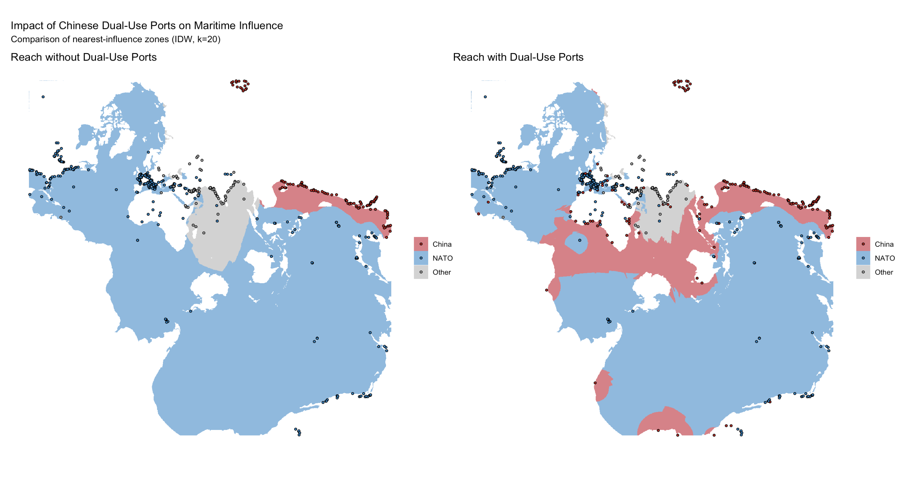
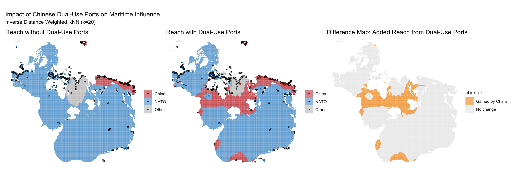

# Trade and Conflict over the Spilhaus World Ocean Map 

It has long been a truism that the global trading system has rested on the development of a supporting naval power. Since the 19th century, Alfred Mahan’s emphasis on maritime power has influenced multiple aspiring super-powers to create navies that can circumnavigate the globe. The United States has resolved this contest in the post-1945 world order with a global network of overseas military bases and vessels. It has tacitly enforced the UN Convention on the Laws of the Sea (UNCLOS) through freedom of navigation operations and secured the transit of freighters.  

Since the relation between maritime trade and the US naval security guarantee has remained largely untested, it is uncertain how much of the former relies on the latter. As other tenets of the international trading system unravel, we wonder how maritime trade may be affected by a changing security guarantee.  The following maps serve as a starting point for problematizing the relationship between maritime trade and naval power.

 ## Maritime Trade Routes, Chokepoints, and Ports

 All maps imply some distortion of the object they represent. This is inevitable when projecting a three-dimensional body to a two-dimensional plane. How a cartographer “projects” a continent or an ocean on a surface is a choice that should obey the function of the map. It follows that a map of maritime trade should use a projection that prioritizes the representation of the seas.

 The Spilhaus projection –known as “the world according to fish”— unfolds the world’s oceans into one continuous view.  The projection accurately portrays bodies of water, but admits large distortions in the Earth’s land mass. The map below presents the world’s oceans as one single interconnected body of water surrounding Antarctica.These maps are based on the *Spilhaus* map projection made available by Ricardo T. Lemos via the [rtlemos/spilhaus GitHub repository](https://github.com/rtlemos/spilhaus) on GitHub :contentReference[oaicite:0]{index=0}.Specifically, the functions `make_spilhaus_xy_gridpoints`, `from_spilhaus_xy_to_lonlat`, `pretify_spilhaus_df`, and others are used to transform geographic coordinates into the Spilhaus projection :contentReference[oaicite:1]{index=1}.

This first map also uses global shipping lane shapefiles from **Global Shipping Lanes / Routes GIS Dataset** hosted on GitHub: [newzealandpaul/Shipping-Lanes](https://github.com/newzealandpaul/Shipping-Lanes) :contentReference[oaicite:0]{index=0}. The dataset provides global shipping lanes georeferenced from the CIA's _Map of The World’s Oceans_ (October 2012), reprojected into the Spilhaus projection. Chokepoints and ports were loaded from the IMF PortWatch dataset, with bubble sizes proportional to vessel traffic. It offers a global picture of how maritime trade flows through shipping routes that join different ports and cross chokepoints that concentrate traffic.

 

  

Note above the density of trade routes on the North Atlantic and over the Pacific. These join Western Europe to the North American East Coast, and South East Asia (SEA) to the North American Western Coast. There are also to clusters of chokepoints, on SEA and around Europe. The three largest chokepoints, the Taiwan Strait, the Starit of Malacca, and the Strait of Korea. 

## Comparative Reach With and Without Dual-Purpose Ports 

While the map above may emphasize global connectivity over the oceans, this surface is also the subject of political conflcit. The following maps overlay overseas military bases and dual-purpose ports to offer a sense of the influence NATO and China over the world's oceans. It relies on the **Overseas Military Bases** dataset by Chun Yin Man and David Alexander Palmer, hosted on HKU’s DataHub. It provides tabular and geospatial data on the overseas military bases of eight global powers (including China), covering information up to **November 2020**, and was first posted on **14 August 2022**. Access it [here](https://datahub.hku.hk/articles/dataset/Overseas_Military_Bases/20438805). 

However, China has extended it's naval reach through the financing and onstruction of ports around the world. These efforts are being tracked by Zongyuan Zoe Liu at the Council on Foreign Relations (CFR). Last updated on **August 26 2024**, it visualizes Chinese investments and ownership stakes in global port projects (129 total, 115 currently active), and assesses their military dual-use potential. View it [here](https://www.cfr.org/tracker/china-overseas-ports). By displaying dual-purpose ports in which there is a majority chinese ownership, we offer a sense of how the use of this resource could have extende Chinese maritime influence. 

 

  

The two maps influence maps above use inverse distance weighting, so that the influece of a port decreases with distance, based on the nearest 20 neighbours. This means that each cell of the ocean's surface is painted according to the country or country-group of its 20 closes ports or military bases. The comparison highlights how China’s dual-purpose port investments have extended its maritime footprint—especially in strategic transit zones like chokepoints and shipping corridors.  In particular, China seems to have gained reach over NATO in the Southern Atlantic, as well as other parts of the Indian Ocean. Finally, the last map includes in orange the change introduced by the construction of dual-purpose ports.

 

  

## Trade Routes Overlaid on Smoothed Maritime Influence Map

The last map overlays shipping route dataset on the previous maritime influence map. Routes were classified by importance (Major, Middle, Minor, corresponding to vessel frequency) and overlaid with matching line weights. The purpose of this is to show how the network of trade routes intersects with zones of maritime influence, emphasizing where strategic port reach aligns with global trade arteries. 

 

  

While NATO still covers the two most important oceans for trade routes; China has gained influence over the Strait of Malacca, a critical chokepoint, as well as over the at-times critical contour of Western Africa.
