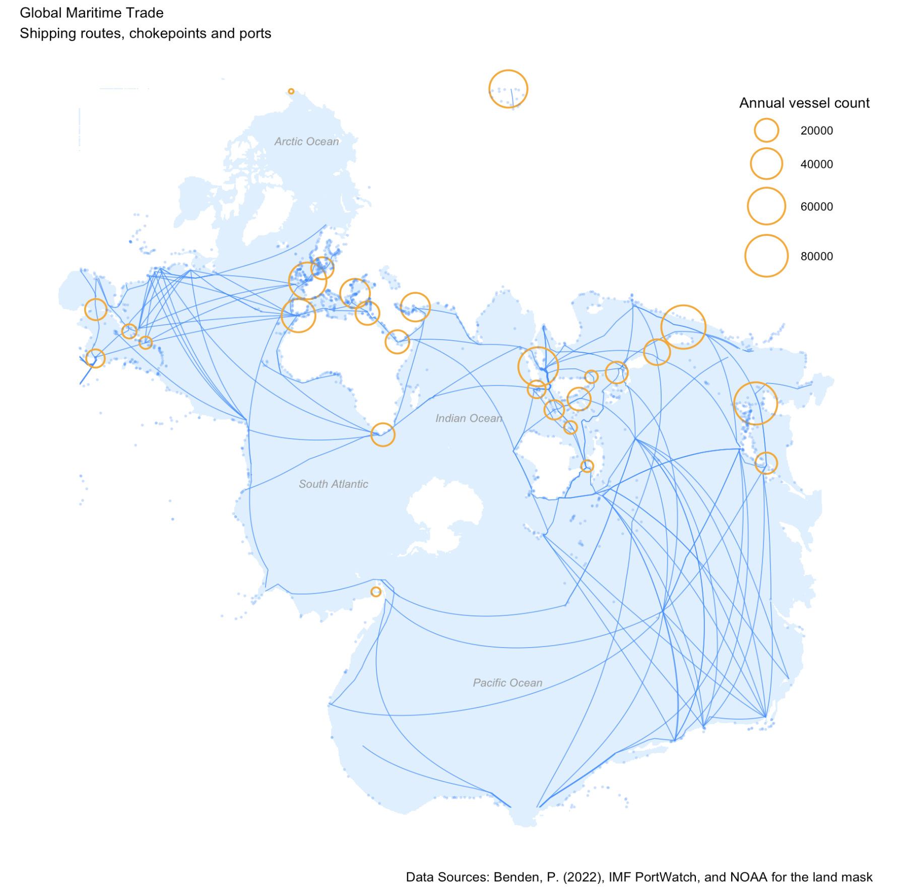

# Spilhaus-Projections-on-Trade-and-Conflict

mention;  https://github.com/rtlemos/spilhaus/blob/main/spilhaus_sst.png  
## Summary

It has long been a truism that the global trading system has rested on the development of a supporting naval power. Since the 19th century, Alfred Mahan’s emphasis on maritime power has influenced multiple aspiring super-powers to create navies that can circumnavigate the globe. The United States has resolved this contest in the post-1945 world order with a global network of overseas military bases and vessels. It has tacitly enforced the UN Convention on the Laws of the Sea (UNCLOS) through freedom of navigation operations and secured the transit of freighters.  

Since the relation between maritime trade and the US naval security guarantee has remained largely untested, it is uncertain how much of the former relies on the latter. As other tenets of the international trading system unravel, we wonder how maritime trade may be affected by a changing security guarantee.  The following maps serve as a starting point for problematizing the relationship between maritime trade and naval power.

 ## Maritime Trade Routes, Chokepoints, and Ports
 
 

 

  

 

  

 

  

 

  

